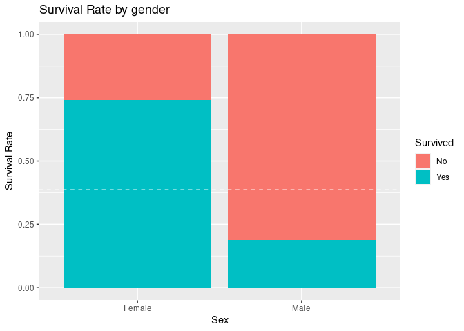

Main
================

## Data Preparation

``` r
library(tidyverse)
```

    ## ── Attaching packages ─────────────────────────────────────── tidyverse 1.3.1 ──

    ## ✓ ggplot2 3.3.3     ✓ purrr   0.3.4
    ## ✓ tibble  3.1.1     ✓ dplyr   1.0.5
    ## ✓ tidyr   1.1.3     ✓ stringr 1.4.0
    ## ✓ readr   1.4.0     ✓ forcats 0.5.1

    ## ── Conflicts ────────────────────────────────────────── tidyverse_conflicts() ──
    ## x dplyr::filter() masks stats::filter()
    ## x dplyr::lag()    masks stats::lag()

``` r
train <- read.csv('train_data.csv')
test <- read.csv('test_data.csv')
class(train)
```

    ## [1] "data.frame"

dplyr contains the glimpse function that enables us to take a quick look
at the data.

``` r
glimpse(train)
```

    ## Rows: 792
    ## Columns: 17
    ## $ X           <int> 0, 1, 2, 3, 4, 5, 6, 7, 8, 9, 10, 11, 12, 13, 14, 15, 16, …
    ## $ PassengerId <int> 1, 2, 3, 4, 5, 6, 7, 8, 9, 10, 11, 12, 13, 14, 15, 16, 17,…
    ## $ Survived    <int> 0, 1, 1, 1, 0, 0, 0, 0, 1, 1, 1, 1, 0, 0, 0, 1, 0, 1, 0, 1…
    ## $ Sex         <int> 1, 0, 0, 0, 1, 1, 1, 1, 0, 0, 0, 0, 1, 1, 0, 0, 1, 1, 0, 0…
    ## $ Age         <dbl> 0.2750, 0.4750, 0.3250, 0.4375, 0.4375, 0.3500, 0.6750, 0.…
    ## $ Fare        <dbl> 0.01415106, 0.13913574, 0.01546857, 0.10364430, 0.01571255…
    ## $ Pclass_1    <int> 0, 1, 0, 1, 0, 0, 1, 0, 0, 0, 0, 1, 0, 0, 0, 0, 0, 0, 0, 0…
    ## $ Pclass_2    <int> 0, 0, 0, 0, 0, 0, 0, 0, 0, 1, 0, 0, 0, 0, 0, 1, 0, 1, 0, 0…
    ## $ Pclass_3    <int> 1, 0, 1, 0, 1, 1, 0, 1, 1, 0, 1, 0, 1, 1, 1, 0, 1, 0, 1, 1…
    ## $ Family_size <dbl> 0.1, 0.1, 0.0, 0.1, 0.0, 0.0, 0.0, 0.4, 0.2, 0.1, 0.2, 0.0…
    ## $ Title_1     <int> 1, 1, 0, 1, 1, 1, 1, 0, 1, 1, 0, 0, 1, 1, 0, 1, 0, 1, 1, 1…
    ## $ Title_2     <int> 0, 0, 0, 0, 0, 0, 0, 0, 0, 0, 0, 0, 0, 0, 0, 0, 0, 0, 0, 0…
    ## $ Title_3     <int> 0, 0, 0, 0, 0, 0, 0, 1, 0, 0, 0, 0, 0, 0, 0, 0, 1, 0, 0, 0…
    ## $ Title_4     <int> 0, 0, 1, 0, 0, 0, 0, 0, 0, 0, 1, 1, 0, 0, 1, 0, 0, 0, 0, 0…
    ## $ Emb_1       <int> 0, 1, 0, 0, 0, 0, 0, 0, 0, 1, 0, 0, 0, 0, 0, 0, 0, 0, 0, 1…
    ## $ Emb_2       <int> 0, 0, 0, 0, 0, 1, 0, 0, 0, 0, 0, 0, 0, 0, 0, 0, 1, 0, 0, 0…
    ## $ Emb_3       <int> 1, 0, 1, 1, 1, 0, 1, 1, 1, 0, 1, 1, 1, 1, 1, 1, 0, 1, 1, 0…

glimpse() tells us how many observations and variables there in the
dataset, and also provides the class of each variable and the first few
observations of each variable. It’s somewhat analogous to the str()
function in base R.

``` r
glimpse(test)
```

    ## Rows: 100
    ## Columns: 17
    ## $ X           <int> 791, 792, 793, 794, 795, 796, 797, 798, 799, 800, 801, 802…
    ## $ PassengerId <int> 792, 793, 794, 795, 796, 797, 798, 799, 800, 801, 802, 803…
    ## $ Survived    <int> 0, 0, 0, 0, 0, 1, 1, 0, 0, 0, 1, 1, 1, 1, 0, 0, 0, 0, 1, 0…
    ## $ Sex         <int> 1, 0, 1, 1, 1, 0, 0, 1, 0, 1, 0, 1, 1, 1, 1, 1, 0, 1, 0, 1…
    ## $ Age         <dbl> 0.20000, 0.35000, 0.35000, 0.31250, 0.48750, 0.61250, 0.38…
    ## $ Fare        <dbl> 0.05074862, 0.13575256, 0.05991421, 0.01541158, 0.02537431…
    ## $ Pclass_1    <int> 0, 0, 1, 0, 0, 1, 0, 0, 0, 0, 0, 1, 0, 0, 0, 1, 0, 0, 1, 0…
    ## $ Pclass_2    <int> 1, 0, 0, 0, 1, 0, 0, 0, 0, 1, 1, 0, 0, 0, 0, 0, 0, 1, 0, 0…
    ## $ Pclass_3    <int> 0, 1, 0, 1, 0, 0, 1, 1, 1, 0, 0, 0, 1, 1, 1, 0, 1, 0, 0, 1…
    ## $ Family_size <dbl> 0.0, 1.0, 0.0, 0.0, 0.0, 0.0, 0.0, 0.0, 0.2, 0.0, 0.2, 0.3…
    ## $ Title_1     <int> 1, 0, 1, 1, 1, 0, 1, 1, 1, 1, 1, 0, 0, 1, 1, 1, 0, 1, 1, 1…
    ## $ Title_2     <int> 0, 0, 0, 0, 0, 1, 0, 0, 0, 0, 0, 0, 0, 0, 0, 0, 0, 0, 0, 0…
    ## $ Title_3     <int> 0, 0, 0, 0, 0, 0, 0, 0, 0, 0, 0, 1, 1, 0, 0, 0, 0, 0, 0, 0…
    ## $ Title_4     <int> 0, 1, 0, 0, 0, 0, 0, 0, 0, 0, 0, 0, 0, 0, 0, 0, 1, 0, 0, 0…
    ## $ Emb_1       <int> 0, 0, 1, 0, 0, 0, 0, 1, 0, 0, 0, 0, 1, 0, 0, 0, 0, 0, 0, 0…
    ## $ Emb_2       <int> 0, 0, 0, 0, 0, 0, 0, 0, 0, 0, 0, 0, 0, 0, 0, 0, 0, 0, 0, 0…
    ## $ Emb_3       <int> 1, 1, 0, 1, 1, 1, 1, 0, 1, 1, 1, 1, 0, 1, 1, 1, 1, 1, 1, 1…

As already mentioned, we can still run standard base R functions , such
as if we would like a summary of the train and test data:

``` r
summary(train)
```

    ##        X          PassengerId       Survived           Sex        
    ##  Min.   :  0.0   Min.   :  1.0   Min.   :0.0000   Min.   :0.0000  
    ##  1st Qu.:197.8   1st Qu.:198.8   1st Qu.:0.0000   1st Qu.:0.0000  
    ##  Median :395.5   Median :396.5   Median :0.0000   Median :1.0000  
    ##  Mean   :395.5   Mean   :396.5   Mean   :0.3864   Mean   :0.6477  
    ##  3rd Qu.:593.2   3rd Qu.:594.2   3rd Qu.:1.0000   3rd Qu.:1.0000  
    ##  Max.   :791.0   Max.   :792.0   Max.   :1.0000   Max.   :1.0000  
    ##       Age                Fare            Pclass_1         Pclass_2     
    ##  Min.   :0.008375   Min.   :0.00000   Min.   :0.0000   Min.   :0.0000  
    ##  1st Qu.:0.275000   1st Qu.:0.01547   1st Qu.:0.0000   1st Qu.:0.0000  
    ##  Median :0.350000   Median :0.02830   Median :0.0000   Median :0.0000  
    ##  Mean   :0.368244   Mean   :0.06468   Mean   :0.2437   Mean   :0.2083  
    ##  3rd Qu.:0.437500   3rd Qu.:0.06104   3rd Qu.:0.0000   3rd Qu.:0.0000  
    ##  Max.   :1.000000   Max.   :1.00000   Max.   :1.0000   Max.   :1.0000  
    ##     Pclass_3      Family_size         Title_1          Title_2        
    ##  Min.   :0.000   Min.   :0.00000   Min.   :0.0000   Min.   :0.000000  
    ##  1st Qu.:0.000   1st Qu.:0.00000   1st Qu.:0.0000   1st Qu.:0.000000  
    ##  Median :1.000   Median :0.00000   Median :1.0000   Median :0.000000  
    ##  Mean   :0.548   Mean   :0.08864   Mean   :0.7449   Mean   :0.005051  
    ##  3rd Qu.:1.000   3rd Qu.:0.10000   3rd Qu.:1.0000   3rd Qu.:0.000000  
    ##  Max.   :1.000   Max.   :1.00000   Max.   :1.0000   Max.   :1.000000  
    ##     Title_3          Title_4           Emb_1            Emb_2        
    ##  Min.   :0.0000   Min.   :0.0000   Min.   :0.0000   Min.   :0.00000  
    ##  1st Qu.:0.0000   1st Qu.:0.0000   1st Qu.:0.0000   1st Qu.:0.00000  
    ##  Median :0.0000   Median :0.0000   Median :0.0000   Median :0.00000  
    ##  Mean   :0.0404   Mean   :0.2096   Mean   :0.1856   Mean   :0.09217  
    ##  3rd Qu.:0.0000   3rd Qu.:0.0000   3rd Qu.:0.0000   3rd Qu.:0.00000  
    ##  Max.   :1.0000   Max.   :1.0000   Max.   :1.0000   Max.   :1.00000  
    ##      Emb_3      
    ##  Min.   :0.000  
    ##  1st Qu.:0.000  
    ##  Median :1.000  
    ##  Mean   :0.721  
    ##  3rd Qu.:1.000  
    ##  Max.   :1.000

Let’s just quickly check that all the column names are the same,

``` r
setdiff(names(train), names(test))
```

    ## character(0)

The first obvious question is: What proportion of people survived? Here
we can use the summarise() (or summarize!) function from dplyr to do a
quick calculation.

``` r
summarise(train, SurvivalRate= sum(Survived)/nrow(train)*100)
```

    ##   SurvivalRate
    ## 1     38.63636

The survival rate among the train set was only 38.63%. If we didn’t have
any information whatsoever about individual passengers then we could
guess that they all died and be correct 61.37% of the time for the train
data. Let’s use this naive approach to make a prediction for the test
data (setting Survived to 0 for everyone) and see what happens when we
submit it :

``` r
baseline_solution <- data.frame(PassengerID = test$PassengerId, Survived = 0)
# To submit this as an entry, just un-comment the next line and submit the .csv file 
# write.csv(baseline_solution, file = 'baseline_model.csv', row.names = F) 
```

So now that we at least have an idea of a minimum target to beat, let’s
collect all the data together using a full\_join() (from dplyr) and get
to work on it.

``` r
titanic <- full_join(train, test)
```

    ## Joining, by = c("X", "PassengerId", "Survived", "Sex", "Age", "Fare", "Pclass_1", "Pclass_2", "Pclass_3", "Family_size", "Title_1", "Title_2", "Title_3", "Title_4", "Emb_1", "Emb_2", "Emb_3")

``` r
glimpse(titanic)
```

    ## Rows: 891
    ## Columns: 17
    ## $ X           <int> 0, 1, 2, 3, 4, 5, 6, 7, 8, 9, 10, 11, 12, 13, 14, 15, 16, …
    ## $ PassengerId <int> 1, 2, 3, 4, 5, 6, 7, 8, 9, 10, 11, 12, 13, 14, 15, 16, 17,…
    ## $ Survived    <int> 0, 1, 1, 1, 0, 0, 0, 0, 1, 1, 1, 1, 0, 0, 0, 1, 0, 1, 0, 1…
    ## $ Sex         <int> 1, 0, 0, 0, 1, 1, 1, 1, 0, 0, 0, 0, 1, 1, 0, 0, 1, 1, 0, 0…
    ## $ Age         <dbl> 0.2750, 0.4750, 0.3250, 0.4375, 0.4375, 0.3500, 0.6750, 0.…
    ## $ Fare        <dbl> 0.01415106, 0.13913574, 0.01546857, 0.10364430, 0.01571255…
    ## $ Pclass_1    <int> 0, 1, 0, 1, 0, 0, 1, 0, 0, 0, 0, 1, 0, 0, 0, 0, 0, 0, 0, 0…
    ## $ Pclass_2    <int> 0, 0, 0, 0, 0, 0, 0, 0, 0, 1, 0, 0, 0, 0, 0, 1, 0, 1, 0, 0…
    ## $ Pclass_3    <int> 1, 0, 1, 0, 1, 1, 0, 1, 1, 0, 1, 0, 1, 1, 1, 0, 1, 0, 1, 1…
    ## $ Family_size <dbl> 0.1, 0.1, 0.0, 0.1, 0.0, 0.0, 0.0, 0.4, 0.2, 0.1, 0.2, 0.0…
    ## $ Title_1     <int> 1, 1, 0, 1, 1, 1, 1, 0, 1, 1, 0, 0, 1, 1, 0, 1, 0, 1, 1, 1…
    ## $ Title_2     <int> 0, 0, 0, 0, 0, 0, 0, 0, 0, 0, 0, 0, 0, 0, 0, 0, 0, 0, 0, 0…
    ## $ Title_3     <int> 0, 0, 0, 0, 0, 0, 0, 1, 0, 0, 0, 0, 0, 0, 0, 0, 1, 0, 0, 0…
    ## $ Title_4     <int> 0, 0, 1, 0, 0, 0, 0, 0, 0, 0, 1, 1, 0, 0, 1, 0, 0, 0, 0, 0…
    ## $ Emb_1       <int> 0, 1, 0, 0, 0, 0, 0, 0, 0, 1, 0, 0, 0, 0, 0, 0, 0, 0, 0, 1…
    ## $ Emb_2       <int> 0, 0, 0, 0, 0, 1, 0, 0, 0, 0, 0, 0, 0, 0, 0, 0, 1, 0, 0, 0…
    ## $ Emb_3       <int> 1, 0, 1, 1, 1, 0, 1, 1, 1, 0, 1, 1, 1, 1, 1, 1, 0, 1, 1, 0…

The Survived variable is binary, either someone died or survived. Let’s
make it a factor and give it each level a name so that it is more
“readable”. Here we use another useful package that is supplied with
tidyverse, forcats, which (as the name suggests!) is specifically
designed for manipulation of categorical data.

``` r
library(forcats)
titanic <- titanic %>%
  mutate(Survived = factor(Survived)) %>%
  mutate(Survived = fct_recode(Survived, "No" = "0", "Yes" = "1"))
```

### Feature Engineering

Let’s start by recoding Sex to a factor and tidying up the labels. Then
we’ll add a proportional bar plot to examine survival rate by gender.

``` r
titanic <- titanic %>% 
  mutate(Sex = factor(Sex)) %>% 
  mutate(Sex = fct_recode(Sex,  "Female" = "0", "Male" = "1"))
```

``` r
ggplot(titanic[1:891,], aes(Sex, fill = Survived)) +
  geom_bar(position = "fill")+
  ylab("Survival Rate")+
  geom_hline(yintercept = (sum(train$Survived)/nrow(train)), col="white", lty = 2)+
  ggtitle("Survival Rate by gender")
```

<!-- -->
